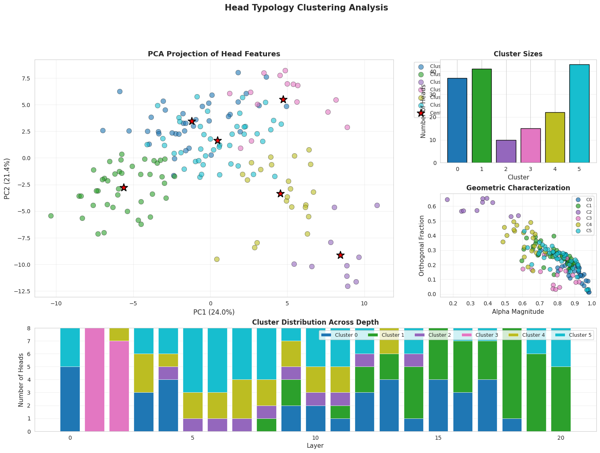

# Addressed State Attention (ASA)

**Interpretable slot-based attention achieving competitive language modeling performance**

## Functional overview



📊 **187M params:** 3.73 val loss / 41.6 PPL (FineWeb, 75k steps)  
🔬 **Mechanistic:** Refinement = directional suppression (α = -0.81)  
⚡ **Efficient:** O(T·K) vs O(T²) standard attention (K=16 slots)

## Notebooks
**Analysis**:
[](https://colab.research.google.com/github/digitaldaimyo/AddressedStateAttention/blob/main/notebooks/asa_analysis.ipynb)

**Training**:
[](https://colab.research.google.com/github/digitaldaimyo/AddressedStateAttention/blob/main/notebooks/asa_training.ipynb)

Browse all notebooks: https://github.com/digitaldaimyo/AddressedStateAttention/tree/main/notebooks


[Paper](paper_drafts/ASA_Mechanistic.pdf) | [Weights (HF)](https://huggingface.co/DigitalDaimyo/AddressedStateAttention) | [Demo](#quick-start)

---

## Quick Start

```python

# Install directly from GitHub
!pip install git+https://github.com/DigitalDaimyo/AddressedStateAttention.git

from asa import load_asm_checkpoint, generate
from transformers import AutoTokenizer
from huggingface_hub import hf_hub_download
import torch

device = "cuda" if torch.cuda.is_available() else "cpu"
print(f"device: {device}")

# Download checkpoint from Hugging Face
ckpt_path = hf_hub_download(
    repo_id="DigitalDaimyo/AddressedStateAttention",
    filename="checkpoints/fineweb_187M_75k.pt"
)
print("ckpt_path resolved.")

# Load checkpoint
model, cfg, ckpt = load_asm_checkpoint(
    ckpt_path,
    mode="analysis"
)
print("ckpt loaded.")

tokenizer = AutoTokenizer.from_pretrained("gpt2")
print("tokenizer set.")

# Generate text
print("performing inference...")
prompt = "John knew what he had to"

out = generate(
        model,
        tokenizer,
        prompt,
        max_new_tokens=120,
        strategy="sample", # or greedy
        temperature=0.75,
        top_p=0.92,
        top_k=50,
        repetition_penalty=1.2,
        no_repeat_ngram_size=4,
        device=device,
    )

print(f"Prompt: '{prompt}'...")
print(f"Gen: {out}")
```
---
## Results

| Model | Params | Dataset | Steps | Loss ↓ | PPL ↓ |
|:------|------:|:--------|-----:|------:|------:|
| ASA   | 187M  | FineWeb | 75k  | 3.73  | 41.6  |
